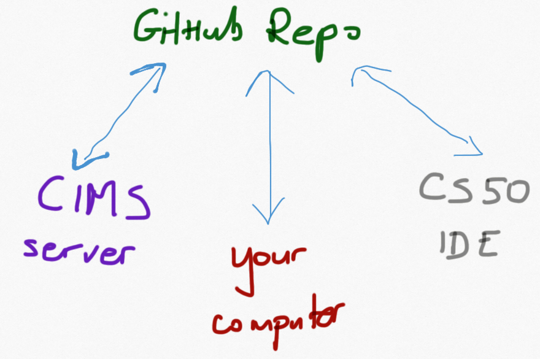

# Computer Systems Organization : Recitation 01
-----------------------------------------------

The purpose of these exercises is to get you up and running with the tools & environment you will be using over the course of the semester. All of the tools that you should be using for this course are available in a standard Linux
distribution. You may be able to install them on your own machine (and in some cases you should), but since there are many different setups and systems, we cannot provide support for the tools on your own system.
The graders and instructors will be using the provided Linux systems and your code has to function properly on those systems.

__Any code that you write this semester (for recitations and for projects) has to _work_ (i.e., compile and run according to the specification) in those Linux environments.__

Today you will do the following...

* Create a GitHub account (if not done already). You can use your existing account or create one specifically for use in this course.
* Setup a workspace on CS50 IDE which provides quick access to an online Linux like IDE that you can use from your browse.  
* Confirm that `git` is installed in the workspace and setup your own `git` identity
* Clone this repository to your workspace  
* Use a few basic Unix/Linux (or rather `bash` commands)
* Compile and execute some programs in C

Detailed instructions on how to do these things are below.

__Note 1:__ Feel free to work with a partner or check in with people around you if you get stuck. If you are working with someone else, make sure that everybody in the group follows the steps in the instructions on their own machine. The only way
to learn these new tools is to use them! If you do not have your own computer with you, then make sure to follow these steps later on.

__Note 2:__ It is very likely that you will not be able to finish everything during the recitation. If you do not finish, try to complete these exercises as soon as possible after the recitation and no later than your next week recitation.  

## Part 1: Create a GitHub account

We will be using a GitHub organization to facilitate working on assignments in this course.
You will be given private repositories within the course organization to complete
all the assignments. These repositories will be visible only to you, your instructors and the graders.

If you do not have a GitHub account, proceed to https://github.com/ and create one.

## Part 2: CS50 IDE  

This week you should setup a CS50 IDE workspace that allows you to create and run programs in a very simple Linux environment that is based on the Ubuntu distribution. (You might have heard about the CS50 class from Harvard. This is the IDE that they use for their intro class.)

Next week you will be given an account on the CIMS Linux server.

- Login to CS50 IDE at https://ide.cs50.io/ . You need your GitHub account to do this.

You should be looking at a window that is subdivided into three major areas:
- file browser on the left hand side
- text editor in the upper half of the screen
- command line interface in the lower half of the screen


## Part 3: `git` & Github

`git` is a “version control system”. It provides, among other things, change tracking for source code files. It comes pre-installed on the Linux platforms that you will be using for the course.

- You can test the install of git on your system by running the command `git` from terminal. This should display the basic help for the command.

- Run the following commands from the command line part of the CS50 IDE:<br>
   ```git config --global user.email "YOUR_EMAIL"```<br>
   ```git config --global user.name "YOUR NAME"```<br>
   (The email should be the same email you used to register your GitHub account. Your name should be your name or nickname    - just make sure that it is proper and recognizable since the instructors and graders will read it.  It can be your GitHub username. ) <br>
   For example, <br>
  ```git config --global user.email "joannakl@cs.nyu.edu"```<br>
  ```git config --global user.name "JoannaKl"```<br>
    <br>
   (You will need to perform the above two steps on the CIMS Linux server next week. These instructions basically setup your `git` identity on a particular computer.)

Github is `git` hosting service. This means they run the servers that host our remote `git` repositories. A repository is just  some source code organized into a collection.

Github has donated an 'organization' for our class. An organization is a private site for us to share repositories as a group. Our organization is called 'nyu-cs201-s20'.

Github will contain repositories for each of the homeworks, in-class code, etc. We will effectively download the code from Github to work on it, then we will upload the code back to Github so it can be graded. We will be doing this all with `git` commands on the command line. This system also serves as a backup of your work and as an easy way to transfer files between the different platforms on which you  might be working.

<center>

</center>

- To learn more about git version control, watch the [git basics videos](http://git-scm.com/videos).
- To learn more about Github, watch [this YouTube video](https://www.youtube.com/watch?v=0fKg7e37bQE).
- A [simple git cheatsheet](http://rogerdudler.github.io/git-guide/).
- A [complete reference](http://www.git-scm.com/book/en/v2).
- A few other tutorials that may be useful:
    * [An Intro to Git and GitHub for Beginners](http://product.hubspot.com/blog/git-and-github-tutorial-for-beginners) by Meghan Nelson
    * [GitHub for Beginners: Don't Get Scared, Get Started](http://readwrite.com/2013/09/30/understanding-github-a-journey-for-beginners-part-1/) by Lauren Orsini  


More on `git` & Github will be covered as needed in lectures and recitations later on, but you should use the above tutorials to learn as much as you can ahead of time.   


## Part 4: Unix/Linux Commands

Most of you are used to interacting with computers and smartphones by a graphical user interface (GUI) and
the touch interface.  As a developer / programmer / advanced user, you
can do your job more efficiently by mastering the command line interface.  In
UNIX, most of the interesting things you want to do can be accomplished by skillfully combining
various commands.  

Your account on CIMS server is for a  Linux system. The CS50 IDE provides a simplified Linux-like environment. Your MacOS laptop (if you have one) is based on BSD
UNIX.  Most UNIX commands you learn apply to all, but there are
variations.


Please read this [Beginner's Guide to the Linux Command Line](https://www.techspot.com/guides/835-linux-command-line-basics/) and [Beginner's Guide to the Linux Command Line, Part II](https://www.techspot.com/guides/844-linux-command-line-part-ii/) for some basics about the command line tools.
For a much more detailed guide you can use
[The Art of Command Line ](https://github.com/jlevy/the-art-of-command-line).
Below is a short list of the most basic commands you will typically use on a day to day basis. This
[cheatsheet](http://cheatsheetworld.com/programming/unix-linux-cheat-sheet/) may also come in handy until
your fingers memorize the most often used commands.

- `man` command displays a manual page (or simply help) for the command (this is the easiest way to learn about options to the commands that you know and about new commands); use up and down arrows to navigate through a manual page; use `q` to exit a manual page
- `pwd` print the name of the present working directory (this is the directory you are currently _in_)
- `ls` list content of the current working directory
- `ls dir_name` list content of the directory named `dir name`
- `cd dir_name` change directory, changes the current working directory to `dir name`
- `cd ..` move one directory up in the directory tree
- `cd` change the current working directory to your home directory
- `cp file1 file2` copy `file1` into `file2`, where `file1` and `file2` can be either relative or absolute path names
- `mv file1 file2` move `file1` into `file2`, where `file1` and `file2` can be either relative or absolute path names
- `rm file` remove a file (there is no undoing it, so be very careful!)
- `mkdir path` make/create a new  directory at the specified path
- `rmdir path` remove the directory specified by the path (there is no undoing it, so be very careful!); you can only remove an empty directory using this method
- `touch file_name` update the access and modification times of the file `file_name` to the current time; if the file does not exist an empty file is created with the name `file_name`
- `echo some_text` print the text to the standard output
- `file file_name` determine the type of a file
- `less file_name` view the file in the terminal
- `more file_name` view the file in the terminal
- `cat file_name1 file_name2 ... file_nameN` concatenate files and print them to standard output
- `head fine_name` print the first 10 lines of the file
- `tail fine_name` print the last 10 lines of the file
- `wget URL` download the file at the specified URL address
- `wc file_name` print newline, word, and byte counts for each file
- `COMMAND_1 | COMMAND_2` (or pipe) redirect standard output produced by one command to the standard input of another command
- `COMMAND > file_name` redirect standard output from a command to a file
- `COMMAND < file_name`  use the content of the file in place of the standard input for a command


### Exercises

If you completed the form with your GitHub username prior to Sunday night, you should see a repository called
`YOUR_USERNAME-rec1` in the course organization. You should be working with that repository for this exercise. Use the name of that repository whenever it says "REPOSITORY_NAME" in the instructions below.

If you do not see a personalized version of `rec1` repository, than you will need to work with the shared repository called `rec1`. Use the name of that repository whenever it says "REPOSITORY_NAME" in the instructions below. You will not be able to complete the last few steps. You should get back to these instructions and repeat them once you get your own repository.

Clone the recitation 1 repository to your own workspace (this time it is the workspace on CS50 IDE instance):

    git clone https://github.com/nyu-cs201-s20/REPOSITORY_NAME

You will be prompted for your username and password on GitHub. (Note that when you type the password, you will not see any text in the terminal. This is normal behavior on a Linux system.)

Run `ls` to verify that a directory called REPOSITORY_NAME was created.    

__Complete each exercise below using command line instructions only!__

For each exercise there are suggested commands that might come in handy. You do not need to use those specific commands. There are many ways to achieve the same goal. Use the Linux manual
pages to figure out how to use those commands (`man cp` gives you the manual page for `cp` command). <br>
(HINT: it may be useful to lookup what `history` command does to answer these questions).

* Change your current working directory to the directory named REPOSITORY_NAME.<br>(`cd`)

* In the 'unix' directory in this repository create a subdirectory called 'backup'. Copy the file foo.txt into it.
<br>(`cd`, `mkdir`, `cp` )

* Rename the original file foo.txt to bar.txt
<br>(`mv`  )

* Under the root folder of the repository, create the directories `multiple/directories`.
<br>(`mkdir`  )

* Create the empty file `test.txt` under `multiple/directories`.
<br>(`touch`  )

* Write "Hello !" into the file without opening it.
<br>(`cat`, `echo`, `>`, and many other options  )

* Output the content of the file to the command line.
<br>(`more`, `less`, `cat`  )

* Remove the folder multiple
<br>(`rm`, `rmdir` )

* The Linux kernel repository maintained by Linus Torvalds can be found at https://github.com/torvalds/linux/tree/master/kernel . Using commend line only, download  the source code for one the file reboot.c located at
https://raw.githubusercontent.com/torvalds/linux/master/kernel/reboot.c
<br>(`wget` )

* Using the command line only (i.e., do not open the file itself in an editor), find out how many lines and how many characters are inside the reboot.c file.
<br>(`wc` )

* Create a file that contains the history of all of the commands that you executed in the steps above. Name this file
`answers.txt`.  This file should be stored at the top level of your repository (i.e., not inside any subdirectory of rec1). <br>(`history`, `>`)


__Submitting your work__

__Note:__ this is not going to be possible until your have your own repository for recitation 1.

Once you completed some significant part of the work on an assignment, you should upload the changes that you made to the remote repository on GitHub. You also have to make sure that your final version is in the repository on GitHub prior to the due date.

To upload the changes you need to complete two steps: commit the changes to the repository and then push them to the remote location. You should run the following commands. Carefully read the output of each of them to verify that it succeeded.

    git add -A    
    git commit -m "answers for questions in part 4"
    git push origin master    

The first step `git add ...` allows you to specify the list of files that you want to add to the repository and them send to the remote location. The `-A` option tells `git` to add all of the files that you modified or created.

The second step `git commit - m "...."` adds the files to the repository (BUT only in your workspace (i.e., on CS50 IDE, or on your computer, or on CIMS server), not in the remote locations). The message after the `-m` option is very important: it describes what is the reason for the commit (example: "finished part 4", or "problem 2 is working now"). It tells you and whoever is looking at your repository (here: graders and instructors) what you did.

The final step `git push origin master` tells `git` to transmit the files to the remote location in the course organization on GitHub.
To verify that this step was successful, go to the repository named `YOUR_USERNAME-rec1` in the course organization and verify that all of the files that you created (especially the file `answers.txt`) are there.


Now, before moving on to the next part, run

    git log

and read through its output. You should see a few commit records. Some of them have been
made by your instructor(s), but at least one of them should be attributed to you. If that is not the case, go back to the configuration step in Part 3 above.


## Part 5: 'Hello World'   

To use the C compiler, you can run the `gcc` command. `gcc`  comes pre-installed in your Linux workspace.

Perform each of the steps below to read, modify, compile and run a simple C program. You can use the editor that is built into the CS50 IDE to view the files (alternatively, you can use one of the command line editors to view and edit the files without using a graphical editor: `nano`, `vi`, `emacs`).

- Open and **read the comments** in `basic.c`.
- Compile the `basic.c` C file. Use `gcc basic.c` in the terminal. This generates an executable `a.out` file (you can run `ls` to verify that the file is actually there).
- Execute it by typing `./a.out`
- Repeat the above three steps for `standard.c` (__remember to read the file first__).
- Edit the `basic.c` so that the program prints
"Hello CSO. My name is YOUR_NAME" message (replace YOUR_NAME with your actual name!).
Save the file. Make sure that it compiles and runs correctly.


Finally, you should commit the changed `basic.c` file to your GitHub repository. If you do not remember how to commit and push changes, lookup the steps from Part 4. (You can only perform this step if you have your own repository for recitation 1, not the shared one.)  

Executing `git log` now, should show that you made at least two commits. 
